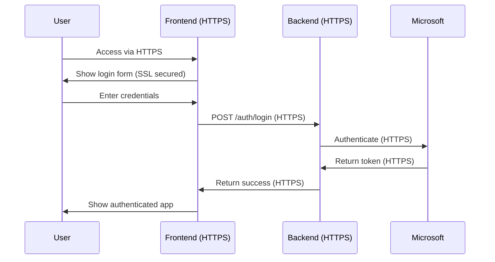

# 🛡️ Secure Azure Deployment with SSL/TLS Configuration

A complete secure web application deployment with SSL/TLS encryption, Microsoft authentication, and comprehensive security headers.

## 🏗️ Architecture

```
┌─────────────────┐    HTTPS/SSL    ┌─────────────────┐
│   Frontend      │◄──────────────►│   Backend       │
│   (Web App)     │                 │   (AKS/Web App) │
│   Port 443      │                 │   Port 8000     │
└─────────────────┘                 └─────────────────┘
         │                                   │
         │ SSL/TLS Encrypted                │ SSL/TLS Encrypted
         ▼                                   ▼
┌─────────────────┐                 ┌─────────────────┐
│   Azure Web App │                 │   Azure AKS     │
│   SSL Enabled   │                 │   SSL Enabled   │
└─────────────────┘                 └─────────────────┘
```

## 📁 Project Structure

```
azure-aks/
├── 📂 frontend-container/          # Frontend Web App
│   ├── 📄 index.html              # SSL-enabled frontend
│   ├── 📄 Dockerfile              # Multi-stage build with SSL
│   ├── 📄 nginx.conf              # Nginx with SSL configuration
│   └── 📄 ssl.conf                # SSL server configuration
├── 📂 secure-backend/             # Backend API
│   ├── 📄 app.py                  # FastAPI with SSL middleware
│   ├── 📄 requirements.txt        # Python dependencies
│   ├── 📄 Dockerfile              # Secure container build
│   └── 📄 k8s-deployment.yaml     # Kubernetes deployment with SSL
├── 📄 deploy.sh                   # Automated deployment script
└── 📄 README.md                   # This file
```

## 🔐 SSL/TLS Security Features

### Frontend Security
- ✅ **HTTPS Redirect**: Automatic HTTP to HTTPS redirection
- ✅ **SSL Certificates**: Self-signed certificates for development
- ✅ **Security Headers**: CSP, HSTS, X-Frame-Options, etc.
- ✅ **TLS 1.2+**: Modern TLS protocols only
- ✅ **Secure Cookies**: HttpOnly and Secure flags

### Backend Security
- ✅ **HTTPS Enforcement**: HTTPSRedirectMiddleware
- ✅ **TLS Configuration**: Strong cipher suites
- ✅ **Security Middleware**: Trusted hosts, CORS with SSL
- ✅ **SSL Context**: Proper SSL certificate handling
- ✅ **Secure Headers**: Comprehensive security headers

## 🚀 Quick Deployment

### Prerequisites
```bash
# Install required tools
az --version          # Azure CLI
docker --version      # Docker
kubectl version       # Kubernetes CLI (for AKS)
```

### One-Command Deployment
```bash
# Make script executable and run
chmod +x deploy.sh
./deploy.sh
```

### Manual Deployment

#### 1. Backend Deployment (AKS)
```bash
# Build and push backend
cd secure-backend
docker build -t bienoai05000008crn.azurecr.io/secure-backend:latest .
docker push bienoai05000008crn.azurecr.io/secure-backend:latest

# Deploy to AKS with SSL
kubectl apply -f k8s-deployment.yaml
```

#### 2. Frontend Deployment (Web App)
```bash
# Build and push frontend
cd frontend-container
docker build -t bienoai05000008crn.azurecr.io/frontend:latest .
docker push bienoai05000008crn.azurecr.io/frontend:latest

# Deploy to Web App
az webapp config container set \
  --name frontend-webapp-container \
  --resource-group bieno-ai05-d-000008-rg \
  --container-image-name bienoai05000008crn.azurecr.io/frontend:latest

# Enable HTTPS only
az webapp update \
  --name frontend-webapp-container \
  --resource-group bieno-ai05-d-000008-rg \
  --https-only true
```

## 🔧 SSL Configuration Details

### Nginx SSL Configuration
```nginx
# SSL protocols and ciphers
ssl_protocols TLSv1.2 TLSv1.3;
ssl_ciphers ECDHE-RSA-AES128-GCM-SHA256:ECDHE-RSA-AES256-GCM-SHA384;
ssl_prefer_server_ciphers off;

# Security headers
add_header Strict-Transport-Security "max-age=31536000; includeSubDomains" always;
add_header X-Frame-Options "DENY" always;
add_header X-Content-Type-Options "nosniff" always;
```

### FastAPI SSL Middleware
```python
# HTTPS redirect middleware
app.add_middleware(HTTPSRedirectMiddleware)

# Trusted host middleware
app.add_middleware(TrustedHostMiddleware, allowed_hosts=["*.azurewebsites.net"])

# Security headers middleware
@app.middleware("http")
async def add_security_headers(request: Request, call_next):
    response = await call_next(request)
    response.headers["Strict-Transport-Security"] = "max-age=31536000; includeSubDomains"
    return response
```

## 🌐 Endpoints

### Frontend (HTTPS Only)
- **URL**: https://frontend-webapp-container.azurewebsites.net
- **Features**: SSL-enabled UI, Microsoft authentication, secure form submission
- **Security**: HTTPS redirect, security headers, CSP

### Backend (HTTPS Only)
- **URL**: https://secure-backend-api.azurewebsites.net
- **Endpoints**:
  - `GET /health` - Health check with SSL status
  - `POST /auth/login` - Microsoft authentication
  - `POST /process` - Secure data processing
  - `GET /oauth/authorize` - OAuth authorization URL
  - `POST /oauth/token` - Token exchange

## 🔐 Authentication Flow



## 🛡️ Security Checklist

- ✅ **HTTPS Enforcement**: All traffic encrypted
- ✅ **TLS 1.2+ Only**: Modern encryption protocols
- ✅ **Security Headers**: HSTS, CSP, X-Frame-Options
- ✅ **Secure Cookies**: HttpOnly, Secure, SameSite
- ✅ **CORS Protection**: Restricted origins
- ✅ **Input Validation**: Pydantic models
- ✅ **Authentication**: Bearer token validation
- ✅ **Container Security**: Non-root user, read-only filesystem
- ✅ **Network Security**: Private container registry
- ✅ **SSL Certificates**: Proper certificate management

## 📊 Monitoring & Health Checks

### Frontend Health Check
```bash
curl -k https://frontend-webapp-container.azurewebsites.net/health
```

### Backend Health Check
```bash
curl -H "Authorization: Bearer demo-secure-token" \
     https://secure-backend-api.azurewebsites.net/health
```

## 🔧 Environment Variables

### Backend Configuration
```bash
AZURE_CLIENT_SECRET=your-client-secret
SSL_CERT_PATH=/app/ssl/cert.pem
SSL_KEY_PATH=/app/ssl/key.pem
```

### Frontend Configuration
- Automatic HTTPS redirect
- CSP headers configured
- SSL certificate auto-generation

## 📝 Production Considerations

### SSL Certificates
```bash
# For production, use Let's Encrypt or Azure certificates
az webapp config ssl upload \
  --certificate-file certificate.pfx \
  --certificate-password password \
  --name frontend-webapp-container \
  --resource-group bieno-ai05-d-000008-rg
```

### Custom Domain
```bash
# Add custom domain with SSL
az webapp config hostname add \
  --webapp-name frontend-webapp-container \
  --resource-group bieno-ai05-d-000008-rg \
  --hostname yourdomain.com

# Bind SSL certificate
az webapp config ssl bind \
  --certificate-thumbprint thumbprint \
  --ssl-type SNI \
  --name frontend-webapp-container \
  --resource-group bieno-ai05-d-000008-rg
```

## 🚨 Troubleshooting

### SSL Issues
```bash
# Check SSL certificate
openssl s_client -connect frontend-webapp-container.azurewebsites.net:443

# Verify TLS version
curl -I --tlsv1.2 https://frontend-webapp-container.azurewebsites.net
```

### Container Issues
```bash
# Check container logs
az webapp log tail --name frontend-webapp-container --resource-group bieno-ai05-d-000008-rg

# Check container status
az webapp show --name frontend-webapp-container --resource-group bieno-ai05-d-000008-rg
```

## 📞 Support

For issues or questions:
1. Check the troubleshooting section
2. Review Azure Web App logs
3. Verify SSL certificate configuration
4. Check security headers with browser dev tools

---

**🔒 Security First**: This deployment prioritizes security with comprehensive SSL/TLS configuration, security headers, and encrypted communication throughout the entire stack.
